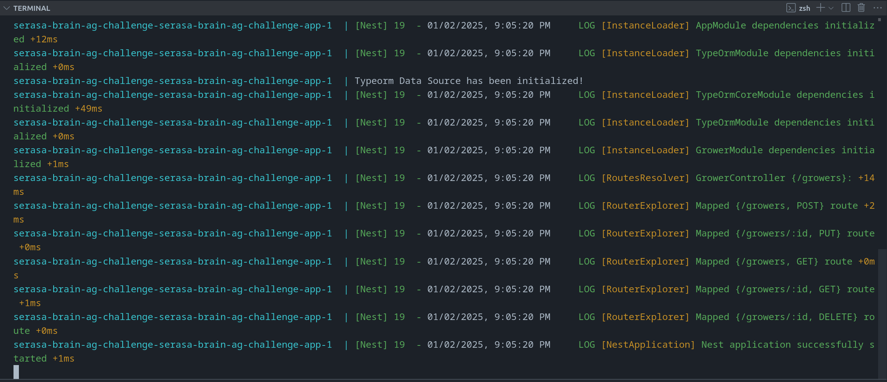

<h1 align="center"> Serasa Brain AG Challenge </h1>

<p align="center">
  

  
  
  <a href="https://github.com/LucasPereiraMiranda/serasa-brain-ag-challenge/commits/main">
    
  </a>

  <a href="https://github.com/LucasPereiraMiranda/serasa-brain-ag-challenge/issues">
    
  </a>

  <a href="https://github.com/LucasPereiraMiranda/serasa-brain-ag-challenge/issues">
    
  </a>
</p>

## Descrição do desafio

A descrição completa do desafio pode ser encontrada no seguinte [link](https://github.com/brain-ag/trabalhe-conosco/blob/main/README.md)

## Execução do projeto localmente com o docker-compose


1) Inicialmente, podemos conferir se existem processos executando nas portas 3000 e 5432. 
Caso houver, precisamos desliga-los temporariamente para a execução do projeto.

2) Podemos copiar o .env.example existente na raiz do projeto, e duplicá-lo com o nome .env:

```bash
$ cp .env.example .env # em ambiente linux
```

3) Podemos executar a instrução:
```bash
$ docker-compose up --build
```


Visando que o docker-compose do projeto levante 2 containers usando as variáveis de ambiente contidas no `.env`:

- 1 associado a aplicação nest: serasa-brain-ag-challenge-app)
- 1 associado ao database postgres: serasa-brain-ag-challenge-db

Ocorrendo assim este preview de execução:




Para rodar migrations, podemos criar a entidade, e após isto rodar:

```bash
$ npm run migration:generate
```

Para criar a migration gerada, podemos rodar:

```bash
$ npm run migration:run
```

Com o banco apontando para localhost durante a execução da migration

## License

[MIT](https://choosealicense.com/licenses/mit/)
