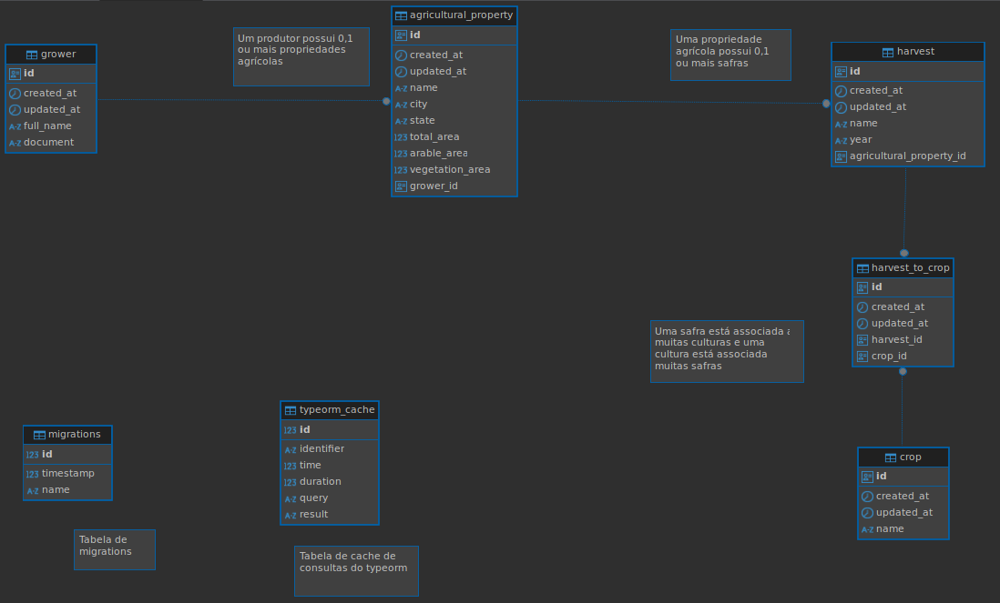
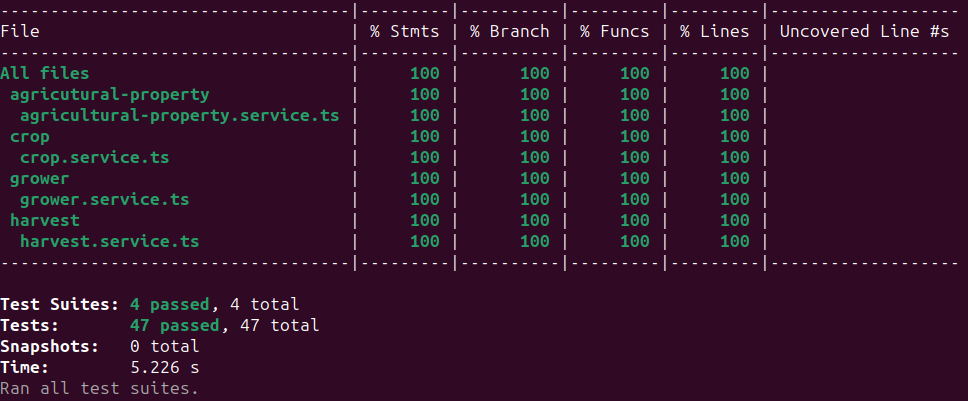
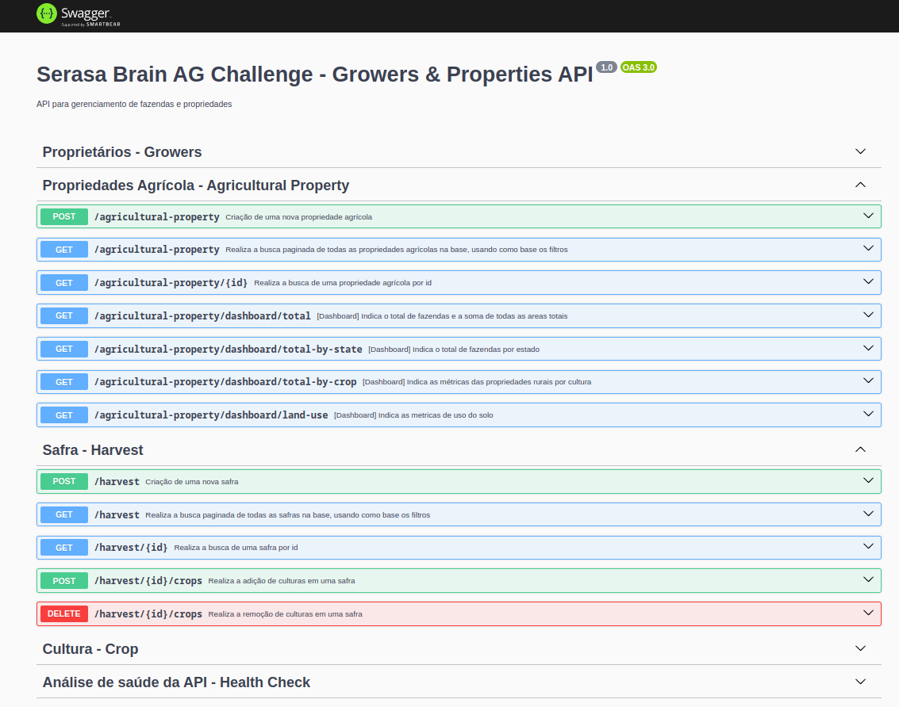

<h1 align="center"> Serasa Brain AG Challenge </h1>

<p align="center">
  

  
  
  <a href="https://github.com/LucasPereiraMiranda/serasa-brain-ag-challenge/commits/main">
    
  </a>

  <a href="https://github.com/LucasPereiraMiranda/serasa-brain-ag-challenge/issues">
    
  </a>

  <a href="https://github.com/LucasPereiraMiranda/serasa-brain-ag-challenge/issues">
    
  </a>
</p>


## Descrição do desafio

O desafio consiste em desenvolver uma aplicação backend para atender aos requisitos descritos no [documento oficial](https://github.com/brain-ag/trabalhe-conosco/blob/main/README.md).

## Techs

A implementação do desafio está utilizando as seguintes tecnologias:

- [Typescript](https://www.typescriptlang.org/)
- [Nest](https://nestjs.com/)
- [Node](https://nodejs.org/en)
- [Typeorm](https://typeorm.io/)
- [Docker](https://www.docker.com/)
- [Docker Compose](https://docs.docker.com/compose/)
- [Postgres](https://www.postgresql.org/)
- [Jest](https://jestjs.io/pt-BR/)
- [Swagger](https://swagger.io/)


## Diagrama de Entidade-Relacionamento

O diagrama de entidade-relacionamento (DER) a seguir foi modelado para representar a estrutura do banco de dados no contexto do desafio. Ele ilustra as entidades principais e seus relacionamentos, fornecendo uma visão ilustrativa do fluxo de dados.




## Execução do projeto

### Docker-compose

Para executarmos o projeto com o docker-compose:

1) Inicialmente, podemos conferir se existem processos executando nas portas 3000 e 5432. 

Caso houver, precisamos desligá-los temporariamente para a execução do projeto a partir do docker-compose.

2) Podemos copiar o .env.example existente na raiz do projeto, e duplicá-lo com o nome .env:

```bash
$ cp .env.example .env # em ambiente linux
```

3) Podemos executar a instrução:
```bash
$ docker-compose up --build
```


Visando que o docker-compose do projeto levante 2 containers usando as variáveis de ambiente contidas no `.env`:

- 1 associado a aplicação nest: serasa-brain-ag-challenge-app
- 1 associado ao database postgres: serasa-brain-ag-challenge-db

Ocorrendo assim este preview de execução:


### Modo local (sem containers)

Para executarmos o projeto com o modo local

1) Podemos copiar o .env.example existente na raiz do projeto, e duplicá-lo com o nome .env:

```bash
$ cp .env.example .env # em ambiente linux
```

2) Podemos instalar as dependencias:

```bash
$ npm install
```

3) Podemos criar o banco de dados, levando em consideração os valores contidos no .env

3) Podemos executar o projeto em modo de desenvolvimento:

```bash
$ npm run start:dev
```

## Execução dos testes

Para executar os testes automatizados, podemos invocar o comando:

```bash
$ npm run test
```

O qual executará os testes unitários trazendo a seguinte previsão:




## Execução das migrations


Para executar as migrations existentes, podemos invocar o comando:

```bash
$ npm run migration:run
```

Para gerar uma nova migration a partir de uma nova entidade, podemos executar:

```bash
$ npm run migration:generate
```

**Observação**: Para executar estes processos, precisamos que o container associado ao postgres esteja ativo. Para executar as migrations via terminal, precisamos apontar para o container (no redirecionamento para o localhost) durante a execução da migration.

## Swagger

A aplicação contém um Swagger, que inclui os contratos e especificações para comunicação com a API. Ao executar a aplicação localmente com o Docker, o Swagger pode ser acessado por meio da seguinte URI:

```bash
$ http://localhost:3000/api#/
```

O preview do swagger esta presente na imagem abaixo:




## Considerações feitas durante o desenvolvimento

### Estratégias para escalabilidade e confiabilidade em situações de grande carga

Para garantir que o sistema seja capaz de suportar um grande número de usuários simultâneos, foram implementadas as seguintes soluções:

- **Adição de Índices**: Índices foram adicionados nas colunas frequentemente acessadas, como nativamente nas chaves primárias e em colunas usadas em filtros e buscas (crop.name), para melhorar o desempenho geral das consultas.


- **Adição de Cache**: A utilização de cache foi implementada por meio da estratégia de armazenar resultados de consultas frequentes, reduzindo a carga nas tabelas que crescerão em densidade de dados com o intuito de manter um tempo saudável de resposta para os usuários e reduzir cargas no banco. A estratégia utilizada está contida no presente [link](https://orkhan.gitbook.io/typeorm/docs/caching).

- **Adição de Paginação**: Foi implementada a paginação nos endpoints que retornam muitos registros. Isso foi feito para evitar consultas que retornem grandes volumes de dados de uma só vez, ajudando a reduzir o tráfego de dados e melhorando a performance ao acessar as informações de forma mais controlada.

### Estratégias para observabilidade

A observabilidade é um fator importante para garantir o bom funcionamento do sistema produtivo. Para isso, foram implementadas as seguintes estratégias no desafio:


- **Colunas para histórico de comportamento das entidades**: Embora as colunas created_at e updated_at não sejam diretamente responsáveis pela monitoração do sistema em tempo real, elas fornecem informações importantes sobre o histórico e o comportamento dos registros ao longo do tempo. Esses dados podem ser utilizados para auditoria no decorrer do tempo.

- **Criação de Fluxo de Health Check**: Foi implementado um fluxo de health check para observar o status das partes críticas do sistema, como banco de dados.

```json
{
  "uptime": 538.826759168,
  "healthMessage": "OK",
  "checks": [
    {
      "name": "Database",
      "status": true,
      "details": "Connected"
    }
  ]
}
```

Estratégias que podem ser propostas:

- **APM**: Como passo futuro, pode ser sugerido a adição de um APM como [Elastic](https://www.elastic.co/pt/observability/application-performance-monitoring) ou [Datadog](https://www.datadoghq.com/product/apm/) para ajudar na observabilidade geral da aplicação.


## License

[MIT](https://choosealicense.com/licenses/mit/)
